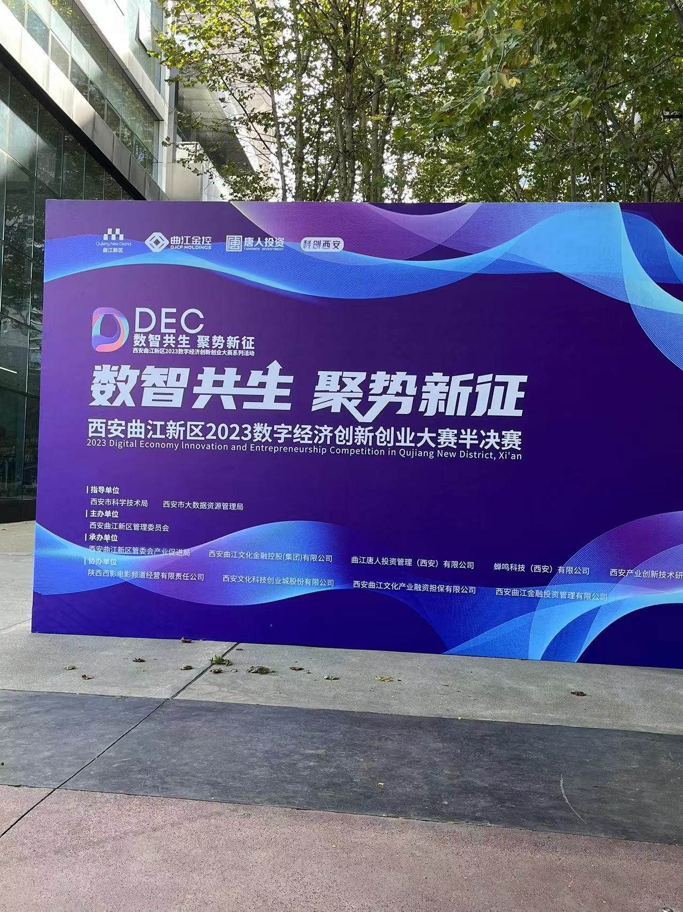
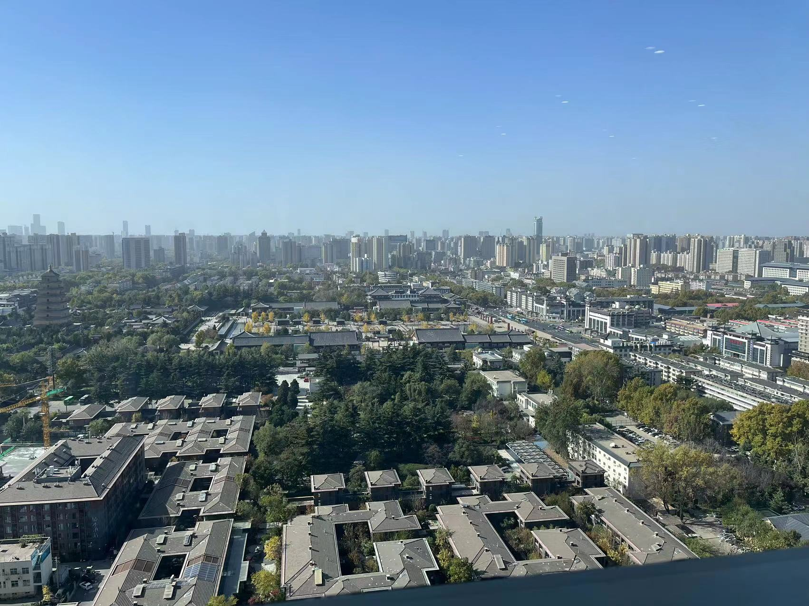
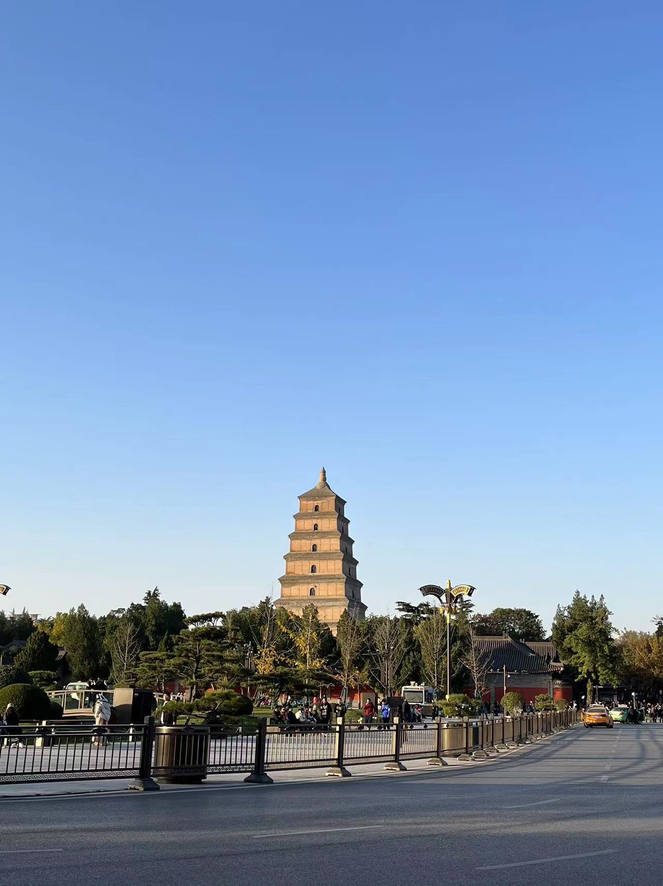

## 首次参加 BP 比赛

最近参加了西安曲江新区举办的 2023 年数字经济创新创业大赛，因为是第一次参加所以我打算记录一下。我在 9 月份填写了报名表，整个比赛流程一直延续到 11 月的复赛路演。在这期间，我接触到了曲江新区两位专业老师，感谢他们对我们的项目进行了一次线下面对面的交流，并为我们提供同行业的联系方式。

复赛路演的 16 号那天，整个比赛过程非常顺利。在与各位老师和创业伙伴分享中，我也发现了一些好的思路，然而，我也认识到了一些可以改进的方面。

首先，我在演讲汇报中感到了一些紧张，这可能影响了我表达的流畅度。下一次我会更注重提前准备和演练，以确保自己在台上更为自信。

其次，我意识到我对制造业行业的真正诉求和痛点了解还不够深入。这是一个需要更多调研和沟通的领域，我会在这方面投入更多时间，以确保我的解决方案更切实地满足市场需求。

最后，**我想强调在比赛中我意识到了一个重要的方面，那就是团队的重要性**。相比其他团队，我是一个独自参赛的个人选手，而在复赛路演中，我认识到一个人的力量是有限的。在未来的创业过程中，我将更加注重团队的建设和扩张，团队是项目成功的关键。

虽然这次未能进入决赛，但带给了我经验，为未来再一次做 BP 演讲汇报做好更充分的准备。

### 比赛方的照片

环境是相当的不错啊 lol~

### 偶遇大雁塔

路过大雁塔的时候，拍了一张照片，好久没来过曲江这边了，感觉变化还是挺大的。

