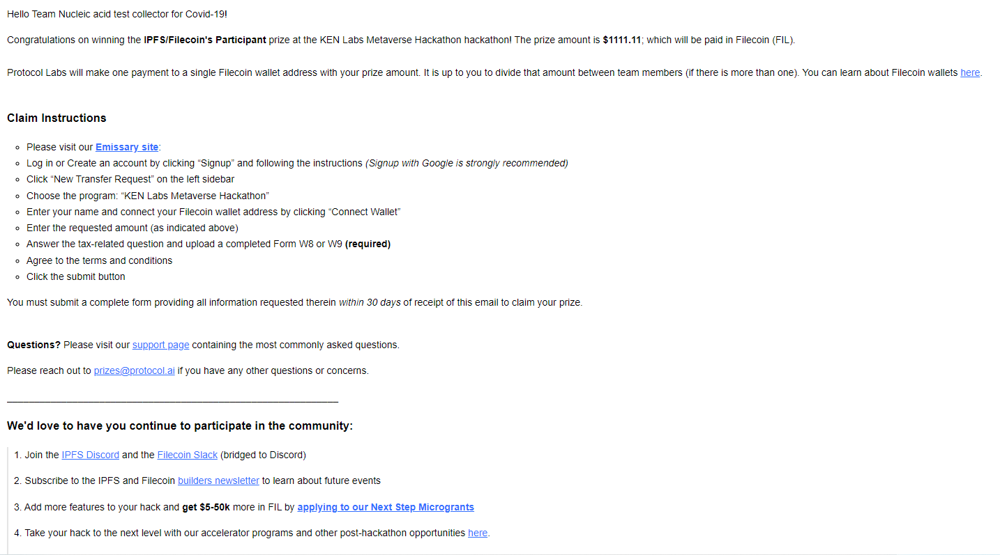

## KEN Labs 元宇宙黑客松

2022 年 7 月 5 号，我通过 Boss 直聘了解到了一场比赛，最初只是想找份工作。没想到，HR 建议我参加比赛试试手，于是我决定闲着也是闲着，动手做了一个项目和相应的 PPT。出乎意料的是，这次比赛获得了参与建设奖，奖金约为 1111.11 美金，通过 FIL 方式支付给我们。取得奖金后，我遇到了一个小麻烦，需要填写税务表格 W-8 或者 W-9，而我对这方面不太了解，下面做一些解释。

### W-8 和 W-9 表格

W-8 表格主要用于中国居民，在美国赚取收入时的税务处理。填写这个表格是为了证明我不是美国居民，以确保支付奖金时扣除的税款符合相关法规。本次比赛中，我填写的是 W-8BEN 表格。

相对而言，W-9 表格则是给美国居民用的。填写这个表格时，需要提供纳税人识别号（社会安全号或纳税人识别号），以及其他相关信息。这样支付方能够在报告时正确扣除适当的税款。

简而言之，这两个表格都涉及到税务划扣的问题。W-8 用于非美国居民，而 W-9 用于美国居民。通过填写正确的表格，可以确保在获得奖金时遵循相关税收法规。

### 项目介绍

这次我选择的项目主题是 COVID-19 检测，技术这块我使用 Rust Web 和 IPFS API 做集成开发。前端用了一个简单的 Vue 模板，客户端打包采用的 Tauri App，最终可以实现在线采集核酸信息，将个人的核酸数据存放在去中心化分布式存储 IPFS 节点上，通过 Hash 可以访问个人的核酸检测结果。

项目的核心功能之一是在线采集核酸信息，这为用户提供了一种便捷的方式来提交个人数据。通过将核酸数据存储在 IPFS 节点上，实现了数据的去中心化分布式存储，增加了数据的安全性和可靠性。

最后，通过哈希的方式，用户可以轻松地访问个人的核酸检测结果，为用户提供了方便快捷的数据获取途径。整个项目的设计使得 COVID-19 检测的流程更加便捷、数据更安全。

### 比赛结果

